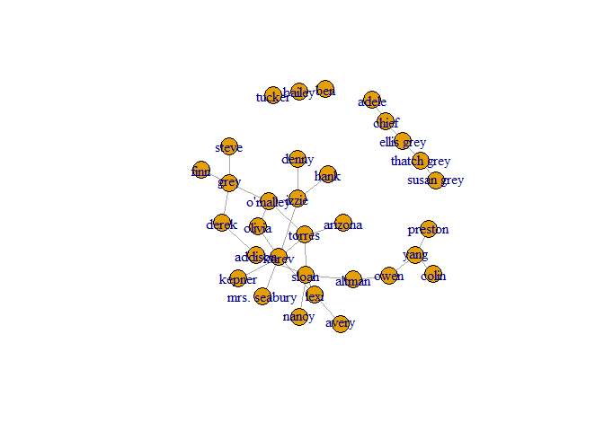
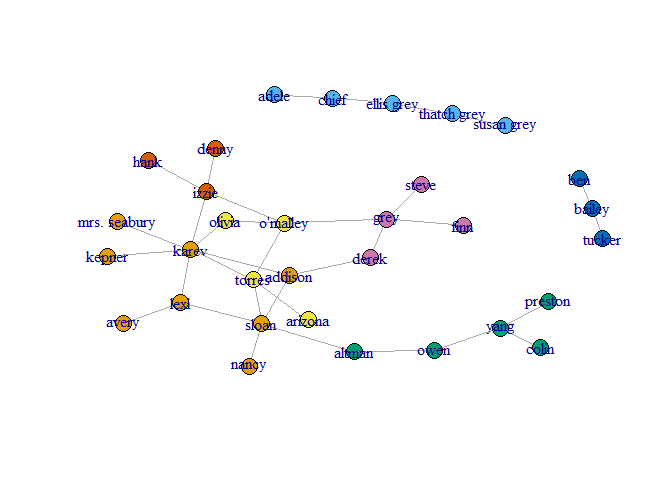
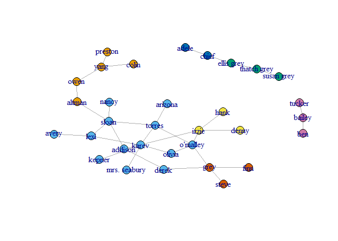
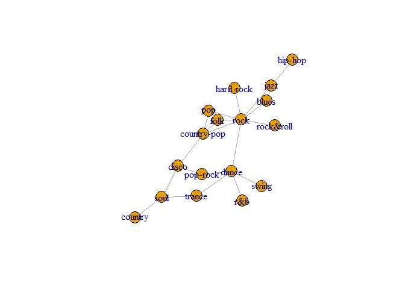
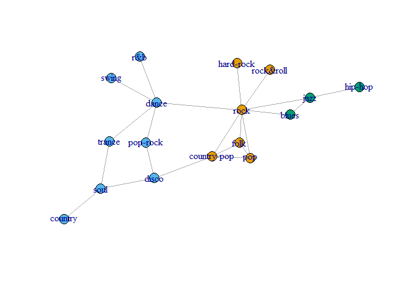
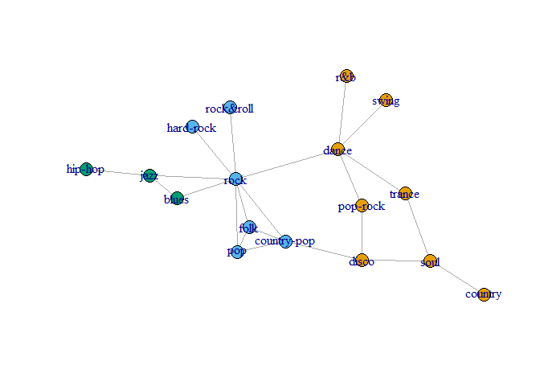

Part 1
======

Q1 a
----

setup home folder

``` r
folder = 'C:/Users/oleg/Desktop/Study/year5/semesterA/dataAnalys/network analys'
setwd(folder)

#Or for all chuncks in this Rmarkdown:
knitr::opts_knit$set(root.dir = folder)
set.seed(123)
```

loading libraries

``` r
library(igraph)
```

    ## Warning: package 'igraph' was built under R version 3.4.3

    ## 
    ## Attaching package: 'igraph'

    ## The following objects are masked from 'package:stats':
    ## 
    ##     decompose, spectrum

    ## The following object is masked from 'package:base':
    ## 
    ##     union

``` r
ga.data <- read.csv('ga_edgelist.csv', header=TRUE, stringsAsFactors=FALSE)
ga.vrtx <- read.csv('ga_actors.csv', header=TRUE, stringsAsFactors=FALSE)
g <- graph.data.frame(ga.data, vertices=ga.vrtx, directed=FALSE)
plot(g)
```



the actor with the maximal betweenness centrality

``` r
g$bet=betweenness(g, v = V(g), directed = FALSE, weights = NULL,
  nobigint = TRUE, normalized = FALSE)

which.max(g$bet)
```

    ## sloan 
    ##    26

the actor with the maximal closeness centrality

``` r
g$clos=closeness(g, vids = V(g), mode = c("all"),
  weights = NULL, normalized = FALSE)
which.max(g$clos)
```

    ## torres 
    ##     30

the actor with the maximal eigenvector centrality

``` r
g$eig=eigen_centrality(g)
max=which.max(g$eig$vector)
max
```

    ## karev 
    ##    17

Q1 b
----

community detection by cluster edge betweenness

``` r
gc1 <-  edge.betweenness.community(g)
memb1 <- membership(gc1)
plot(g, vertex.size=7, vertex.color=memb1, asp=FALSE)
```



the number of communities for cluster edge betweenness

``` r
length(gc1)
```

    ## [1] 7

the size of each community by community index for cluster edge betweenness

``` r
print (sizes(gc1))
```

    ## Community sizes
    ## 1 2 3 4 5 6 7 
    ## 8 5 5 4 3 3 4

the modularity value of gc1

``` r
gc1$modularity
```

    ##  [1] -0.04584775 -0.01773356  0.01081315  0.03849481  0.06617647
    ##  [6]  0.09472318  0.12326990  0.14965398  0.17560554  0.20285467
    ## [11]  0.23096886  0.25865052  0.28633218  0.31358131  0.34083045
    ## [16]  0.36894464  0.39576125  0.41479239  0.44247405  0.46712803
    ## [21]  0.49134948  0.50778547  0.52681661  0.54974048  0.57050173
    ## [26]  0.57742215  0.56098616  0.53416955  0.45804498  0.30449827

maximum modularity

``` r
max(gc1$modularity)
```

    ## [1] 0.5774221

the name of the actor with maximum modularity

``` r
gc1$name[which.max(gc1$modularity)]
```

    ## [1] "sloan"

community detection using cluster walktrap

``` r
gc2 <- walktrap.community(g)
memb2 <- membership(gc2)
plot(g, vertex.size=7, #vertex.label=NA,
     vertex.color=memb2, asp=FALSE)
```



the number of communities for cluster walktrap

``` r
length(gc2)
```

    ## [1] 7

the size of each community by community index for cluster walktrap

``` r
sizes(gc2)
```

    ## Community sizes
    ##  1  2  3  4  5  6  7 
    ##  5 13  3  3  2  3  3

the modularity value of gc2

``` r
gc2$modularity
```

    ##  [1]  0.00000000 -0.01730104  0.01081314  0.03676470  0.06487890
    ##  [6]  0.09256055  0.12024222  0.14749135  0.17387544  0.19982699
    ## [11]  0.22837371  0.25692043  0.28460205  0.31185120  0.33910033
    ## [16]  0.36678201  0.39489621  0.42171276  0.44939446  0.45544982
    ## [21]  0.48226649  0.47923881  0.49567476  0.48875433  0.49394464
    ## [26]  0.51470590  0.48269898  0.50562286  0.45804498  0.30449831
    ## [31]  0.00000000  0.00000000

maximum modularity

``` r
max(gc2$modularity)
```

    ## [1] 0.5147059

the name of the actor with maximum modularity

``` r
gc2$name[which.max(gc2$modularity)]
```

    ## [1] "sloan"

Part 2
======

Q2 a
----

In part 2 of the HW we will take a list of music genres and scrap twittes related to those genres. after scarping we will make a graph of asociated genres and network analyze this graph.

Q2 b
----

the nodes in the graph will be the music genres and the edges will be the asociations from twitts we scraped.

Q2 c
----

initializing environment for twitter scraping

``` r
library(twitteR)
```

    ## Warning: package 'twitteR' was built under R version 3.4.3

``` r
library(httr)
```

    ## Warning: package 'httr' was built under R version 3.4.3

``` r
library(jsonlite)
```

    ## Warning: package 'jsonlite' was built under R version 3.4.3

``` r
library(wordcloud)
```

    ## Warning: package 'wordcloud' was built under R version 3.4.3

    ## Loading required package: RColorBrewer

``` r
library(jsonlite)
library(tm)
```

    ## Warning: package 'tm' was built under R version 3.4.3

    ## Loading required package: NLP

    ## 
    ## Attaching package: 'NLP'

    ## The following object is masked from 'package:httr':
    ## 
    ##     content

``` r
library(devtools)
```

    ## Warning: package 'devtools' was built under R version 3.4.3

``` r
#install.packages("base64enc")
library(base64enc)
library(XML)
library(RCurl)
```

    ## Warning: package 'RCurl' was built under R version 3.4.3

    ## Loading required package: bitops

``` r
library(igraph)
source("twitterOAuth.R")

myapp=oauth_app("twitter",key=consumer_key,secret=consumer_secret)
sig1=sign_oauth1.0(myapp,token=access_token,token_secret=access_secret)
```

``` r
sig <- setup_twitter_oauth(consumer_key, consumer_secret, access_token, access_secret)
```

    ## [1] "Using direct authentication"

``` r
musicGen= read.csv('musicGenres.csv', header=TRUE, stringsAsFactors=FALSE)
musicGen$Genres
```

    ##  [1] "pop"         "rock"        "hard-rock"   "r&b"         "country"    
    ##  [6] "rock&roll"   "soul"        "country-pop" "latin"       "disco"      
    ## [11] "jazz"        "pop-rock"    "dance"       "hip-hop"     "trance"     
    ## [16] "blues"       "folk"        "reggae"      "swing"

scrap twitter for related words and create the asociation graph

``` r
newEdges=c()
for (genre in musicGen$Genres){
  searchRes <- searchTwitter(genre, n=200)
  searchDF <- twListToDF(searchRes)
  for (twitts in searchDF$text){
    tokensForGenre <- strsplit(twitts," ")[[1]]
    tokensForGenre<-unique(tokensForGenre)
    for (token in tokensForGenre){
      if (token !=genre && token %in% musicGen$Genres){
        newEdges=c(newEdges,genre,token)
      }
    }
  }
}
```

    ## Warning in doRppAPICall("search/tweets", n, params = params,
    ## retryOnRateLimit = retryOnRateLimit, : 200 tweets were requested but the
    ## API can only return 75

``` r
g<- graph(newEdges)
A<-get.adjacency(g)
A[A>1]<-1
newg<- graph.adjacency(A)
g<- as.undirected(newg)
plot(g)
```



Q2 d
----

the genre with the maximal betweenness centrality

``` r
g$bet=betweenness(g, v = V(g), directed = FALSE, weights = NULL,
  nobigint = TRUE, normalized = FALSE)

which.max(g$bet)
```

    ## rock 
    ##    2

the genre with the maximal closeness centrality

``` r
g$clos=closeness(g, vids = V(g), mode = c("all"),
  weights = NULL, normalized = FALSE)
which.max(g$clos)
```

    ## rock 
    ##    2

the genre with the maximal eigenvector centrality

``` r
g$eig=eigen_centrality(g)
max=which.max(g$eig$vector)
max
```

    ## rock 
    ##    2

### community detection by cluster edge betweenness

``` r
gc3 <-  edge.betweenness.community(g)
memb3 <- membership(gc3)
plot(g, vertex.size=7,vertex.color=memb3, asp=FALSE)
```



the number of communities for cluster edge betweenness

``` r
length(gc3)
```

    ## [1] 3

the size of each community by community index for cluster edge betweenness

``` r
print (sizes(gc3))
```

    ## Community sizes
    ## 1 2 3 
    ## 6 8 3

the modularity value of gc3

``` r
gc3$modularity
```

    ##  [1] -0.086776860 -0.047520661 -0.007231405  0.032024793  0.065082645
    ##  [6]  0.098140496  0.188016529  0.221074380  0.261363636  0.291322314
    ## [11]  0.328512397  0.365702479  0.392561983  0.418388430  0.425619835
    ## [16]  0.392561983  0.000000000

maximum modularity

``` r
max(gc3$modularity)
```

    ## [1] 0.4256198

the name of the genre with maximum modularity

``` r
gc3$name[which.max(gc3$modularity)]
```

    ## [1] "pop-rock"

### community detection using cluster walktrap

``` r
gc4 <- walktrap.community(g)
memb4 <- membership(gc4)
plot(g, vertex.size=7,vertex.color=memb4, asp=FALSE)
```



the number of communities for cluster walktrap

``` r
length(gc4)
```

    ## [1] 3

the size of each community by community index for cluster walktrap

``` r
sizes(gc4)
```

    ## Community sizes
    ## 1 2 3 
    ## 8 6 3

the modularity value of gc4

``` r
gc4$modularity
```

    ##  [1]  0.00000000 -0.05061983  0.01549587  0.05475206  0.09194215
    ##  [6]  0.12809917  0.16735537  0.20764463  0.24690083  0.28925622
    ## [11]  0.32954547  0.36673555  0.39979339  0.40909094  0.42561984
    ## [16]  0.39256200  0.00000000

maximum modularity

``` r
max(gc4$modularity)
```

    ## [1] 0.4256198

the name of the genre with maximum modularity

``` r
gc4$name[which.max(gc4$modularity)]
```

    ## [1] "pop-rock"
